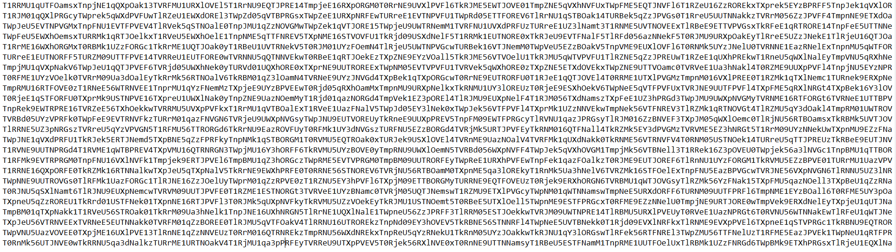
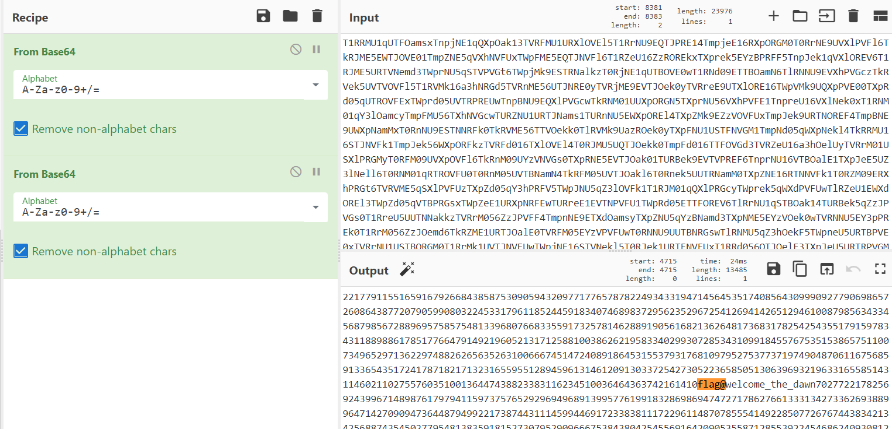
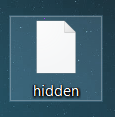
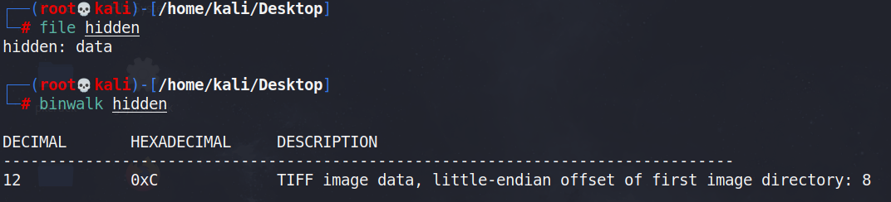
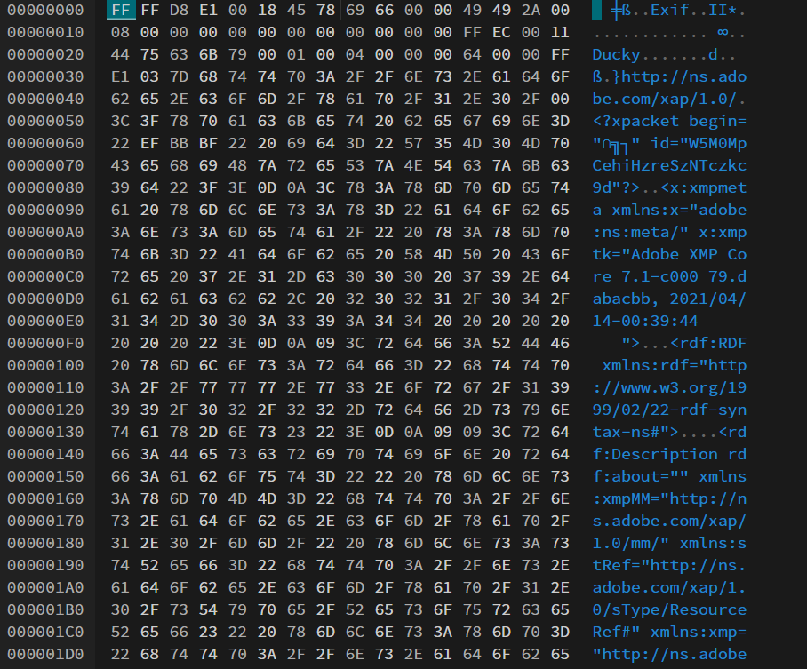
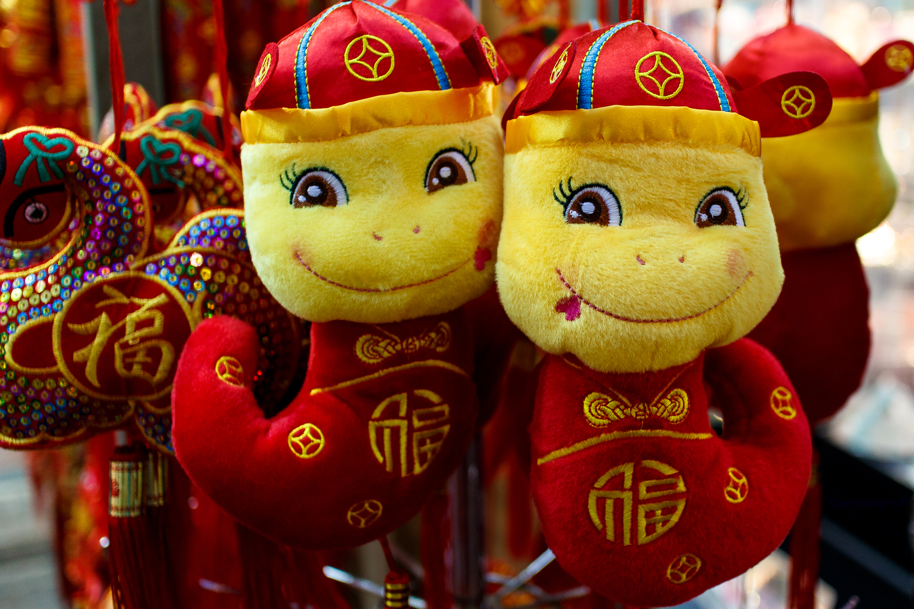
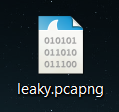

# Cyber SEA Game Selection 2021
Cyber SEA Game Selection CTF for fun

> Declaration: I didn't participate this CTF but I got the challenge from my friend. 

## Q2
**Challenge**



**Solving Process** 

```base64``` decode twice using ```CyberChef```


## Q3
**Solving Process**
1. It is a dotnet application so ```ILSpy``` will do the work.
2. I convert the file to bytes array and wrote this C# script. Run it and get the flag.
```
using System.IO;
using System;
using System.Security.Cryptography;
using System.Text;  

class Program
{
    static void Main()
    {
        string plaintext = null;
        byte[] IV = new byte[] { 0x5E, 0xD1, 0xE3, 0x57, 0xFA, 0x44, 0xD2, 0x5E, 0x0E, 0x8C, 0x4E, 0x4D, 0x60, 0x69, 0x7E, 0x0E };
        byte[] cipherText = new byte[] { 0xB0, 0x46, 0x87, 0x2B, 0x7A, 0x1A, 0x72, 0x5B, 0xAE, 0xC0, 0xCC, 0xD4, 0x82, 0x98, 0x90, 0x74, 
0x92, 0x3A, 0x98, 0xEB, 0x22, 0x5B, 0x3A, 0x43, 0x7D, 0x8D, 0x25, 0x15, 0xDA, 0xC3, 0x9C, 0xB3 };
        using (AesManaged aesAlg = new AesManaged())
        {
            aesAlg.Key = new byte[16]
				{
					1, 3, 5, 7, 9, 2, 4, 6, 8, 16,
					17, 18, 19, 20, 21, 22
				};
            aesAlg.IV = IV;
    
            // Create a decryptor to perform the stream transform.
            ICryptoTransform decryptor = aesAlg.CreateDecryptor(aesAlg.Key, aesAlg.IV);
    
            // Create the streams used for decryption.
            using (MemoryStream msDecrypt = new MemoryStream(cipherText))
            {
                using (CryptoStream csDecrypt = new CryptoStream(msDecrypt, decryptor, CryptoStreamMode.Read))
                {
                    using (StreamReader srDecrypt = new StreamReader(csDecrypt))
                    {
    
                        // Read the decrypted bytes from the decrypting stream
                        // and place them in a string.
                        plaintext = srDecrypt.ReadToEnd();
                    }
                }
            }
            Console.WriteLine(plaintext);
        }
    }
}
```
## Q4
**Challenge**



**Solving Process**
1. Attempt to identify the filetype
   
   From the output of the commands, we can tell that the file contains image data but we cannot directly change the file extension as it seems to be corrupted/modified.
2. The file header of the file should be ```FF D8 FF``` instead of ```FF FF D8``` for JPG file. Simply modify the header and we will get a JPG file.
   
   
3. Next, use ```https://aperisolve.fr/``` which is a online platform which performs layer analysis on image. You will get the following information:
   A:AllYourBase
   B:PowerGreySkull
   OpenStegPuff
4. After some Googling, [OpenPuff](https://embeddedsw.net/OpenPuff_Steganography_Home.html) is found and just enter the A and B password using the previous step finding.
   
## Q5
**Challenge**



**Solving Process**
1. Run the following command: 
   
   ```tshark -r leaky.pcapng -T fields -e dns.qry.name -Y "dns.flags.response eq 0 and dns.qry.name contains cyberseagames.co.jp" > dns_query.txt && sed 's/.cyberseagames.co.jp//g' dns_query.txt > cleaned.txt``` 

   to extract all the DNS query containing ```cyberseagames.co.jp``` and remove the ```.cyberseagames.co.jp```
2. Base64 decode it and search for the flag